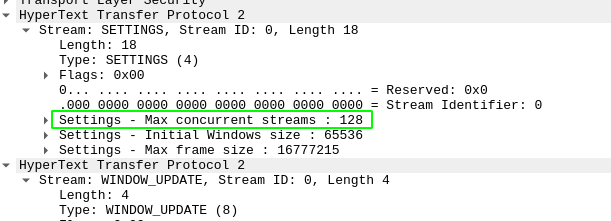
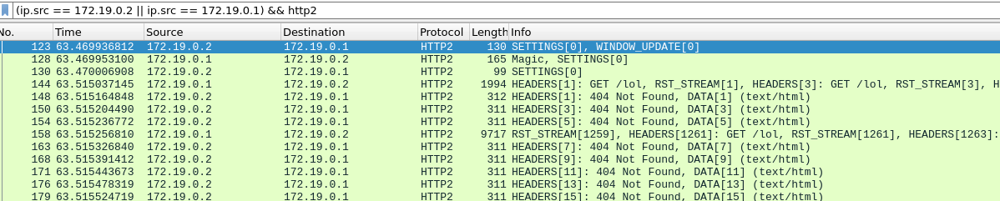
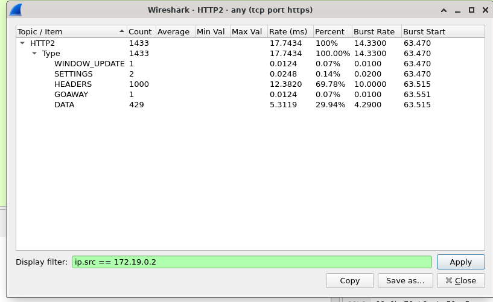

# rr-dev
based on observations made by cloudflare in the excellent blog: https://blog.cloudflare.com/technical-breakdown-http2-rapid-reset-ddos-attack/

no clue if this actually works, but it seems to match the same behavior
mentioned in the blog's pcap, which seems to no longer be available
from their blog link.

## collecting and analyzing
1. start http/2 enabled nginx server:
```
cd server
docker compose up -d
```

2. start capturing traffic in wireshark

3. run poc script:
```
python rr.py
```

4. decode traffic in wireshark using `ssl-keylog.log` as the tls keyfile
5. compare against the cloudflare blog notes (unless you have the pcap which seems to be gone now)

## comparison to blog article
server advertises maximum stream concurrency of 128:



1000 stream headers are sent split into two packets:



>Interestingly, the RST_STREAM for stream 1051 doesn't fit in packet 15, so in packet 16 we see the server respond with a 404 response.  Then in packet 17 the client does send the RST_STREAM, before moving on to sending the remaining 475 requests.

despite exceeding maximum number of advertised streams, the server never sends a RST_FRAME:



> No server RST_STREAM frames are seen in this trace, indicating that the server did not observe a concurrent stream violation. 

## disclaimer lol
this is only a poc, so obviously more work will be needed to test it against your own infrastructure. don't do
that shit for any reason other than research. you -- the reader -- are responsible
for your own actions. i do this solely for research, and fun of
course, because c'mon this shit is so interesting.

prior to today, i had very minimal knowledge of http/2, so i learned a lot from this exercise.
i kept my example code for learning basics of http/2 in python as it gives insight into my process of
learning.

## greetz
greetz to psyk0, shifty, and slerig. who needa stop slackin, but i still love em anyway.
